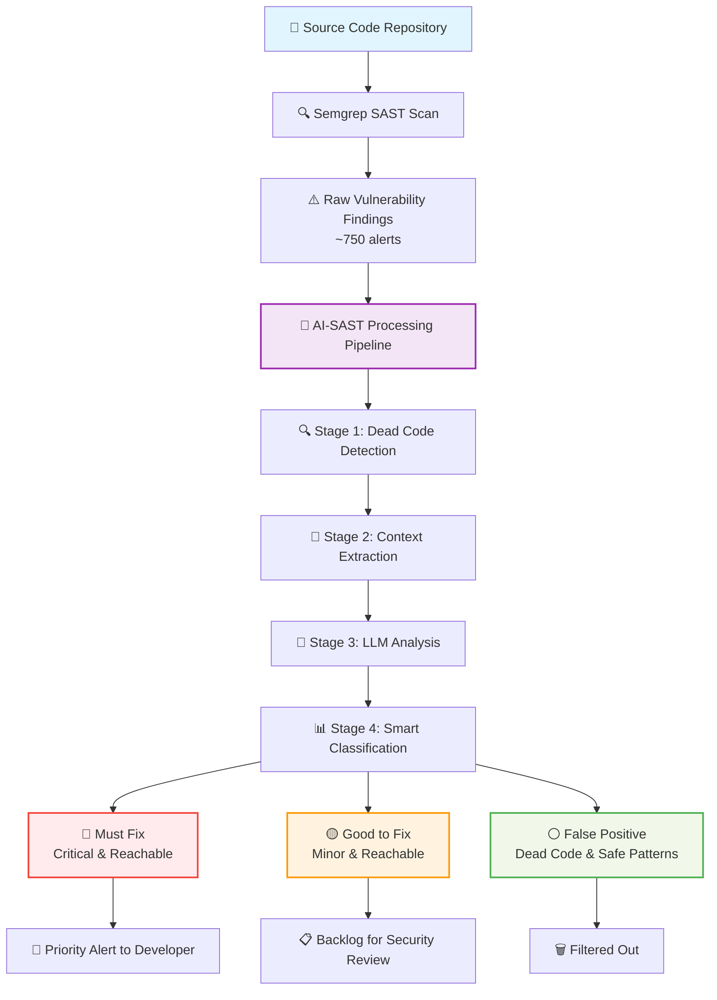

# Web Scraping Suite in Go

This project is a comprehensive web scraping toolkit developed in Go, leveraging the Colly framework for efficient and concurrent web scraping operations.

## Features

1. E-commerce Product Scraper (scrapper1.go)
   - Scrapes product information from an e-commerce website
   - Handles pagination automatically
   - Saves data to a CSV file

2. G2.com Review Scraper(scrapper2.go)
   - Attempts to scrape reviews from G2.com
   - Utilizes proxy support for enhanced anonymity

4. ZenRows API Integration(scrapper3.go)
   - Fetches and saves HTML content from G2.com using the ZenRows API
   - Demonstrates integration with third-party services for web scraping

5. Parallel Scraping(scrapper4.go)
   - Implements concurrent scraping of multiple pages
   - Showcases Go's powerful concurrency features

## Technologies Used

- Go programming language
- [Colly](https://github.com/gocolly/colly) web scraping framework
- Standard Go libraries: `encoding/csv`, `log`, `os`, `sync`, `net/http`, `io`

## How to Run

1. Ensure you have Go installed on your system.
2. Clone this repository:
   ```
   git clone https://github.com/your-username/web-scraping-suite.git
   ```
3. Navigate to the project directory:
   ```
   cd web-scraping-suite
   ```
4. Install dependencies:
   ```
   go mod tidy
   ```
5. Run the desired scraper:
   ```
   go run ecommerce_scraper.go
   go run g2_review_scraper.go
   go run zenrows_scraper.go
   go run parallel_scraper.go
   ```

Note: Make sure to replace any API keys or proxies with your own before running the scripts.

## Potential Enhancements

1. Implement more robust error handling and logging
2. Add command-line arguments for flexible configuration
3. Develop a unified interface to select and run different scrapers
4. Incorporate database storage for scraped data
5. Implement rate limiting to respect website terms of service
6. Add unit tests for each scraper function
7. Create a web interface for easy management and visualization of scraped data

## Disclaimer

This project is for educational purposes only. Always respect website terms of service and robots.txt files when scraping. Ensure you have permission to scrape any website before doing so.

## Contributing

Contributions, issues, and feature requests are welcome. Feel free to check [issues page](https://github.com/your-username/web-scraping-suite/issues) if you want to contribute.


